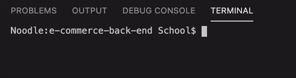
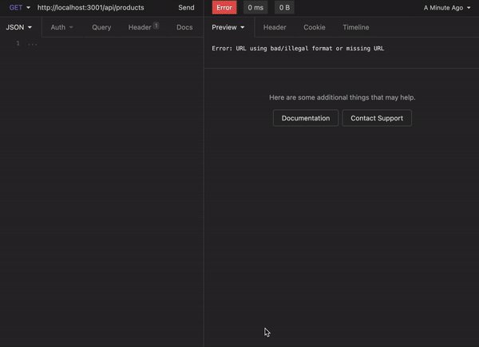
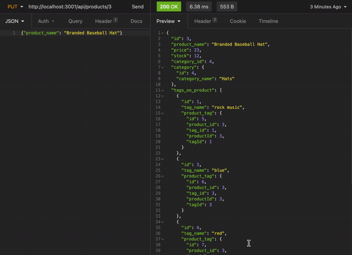
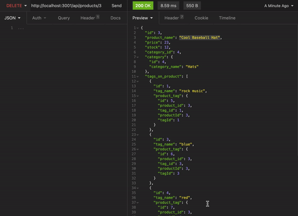

# **E-Commerce Back End** - 
    
**The E-Commerce Back End** is an e-commerce site created by modifying starter code provided by the UT Austin Full Stack Developer bootcamp. The site uses Express.js API to use Sequelize to interact with a MySQL database.
 
 

    
## Table of Contents
* [Requirements](#Requirements)
* [Usage](#Usage)
* [Endpoints](#Endpoints)
* [Demo](#Demo)
* [Contact](#Contact)
* [License](#license)

 
                
## Requirements
This application is dependent on the npm packages Express Sequelize, MySql2 and DotEnv.
 
 
            
## Usage
**E-Commerce Back End** requires npm packages to run. Please make sure [node is installed](https://nodejs.org/en/download/) prior to cloning the repo. You can find instructions for installing node on the [node website](https://nodejs.org/en/download/).
* After you're sure node.js has been installed correctly, clone the [E-Commerce Back End Repo](https://github.com/xander-deanna/e-commerce-back-end) locally onto your computer. Instructions on how to clone from Github can be found on [Github Docs](https://docs.github.com/en/github/creating-cloning-and-archiving-repositories/cloning-a-repository).
* Once the repo has been cloned, please navigate to the correct directory using your terminal or other command line application. 
* Next type <code>npm i</code> into the command line and hit <kbd>enter</kbd> to install all dependencies.
* Please be sure to use the file named "schema.sql" in the "db" folder to create the database locally.
* In order to seed the databade, you will also need to fill out the .envEXAMPLE file with your information, and re-save the file as .env.
* **Last**, seed the database by typing <code>node seeds/index.js</code> and hitting <kbd>enter</kbd>.
  
* Start listending on the newly seeded server by typing <code>node server.js</code> and hitting <kbd>enter</kbd>.
  
* You can interact with the server using the <code>GET</code>, <code>POST</code>, <code>PUT</code>, and <code>DELETE</code> HTTP request methods with the program [Insomnia](https://insomnia.rest/) and the correct API routes, or you can simply use the <code>GET</code> method via your default browser. See the API route endpoints below for additional help.
 
 

## Endpoints
**Categories**
* http://localhost:3001/api/categories
* http://localhost:3001/api/categories/:id

**Tags**
* http://localhost:3001/api/tags
* http://localhost:3001/api/tags/:id

**Products**
* http://localhost:3001/api/products
* http://localhost:3001/api/products/:id
 
 

## Demo

 
 
    
## Contact
Please feel free to contact me with any questions you might have, using the following information:
    
Email: [xander.deanna@gmail.com](mailto:xander.deanna@gmail.com)
 
Github: [https://github.com/xander-deanna](https://github.com/xander-deanna)
 
 

## License
This site was created by **Deanna Alexander** and is covered under the **WTFPL license**.
 
 
